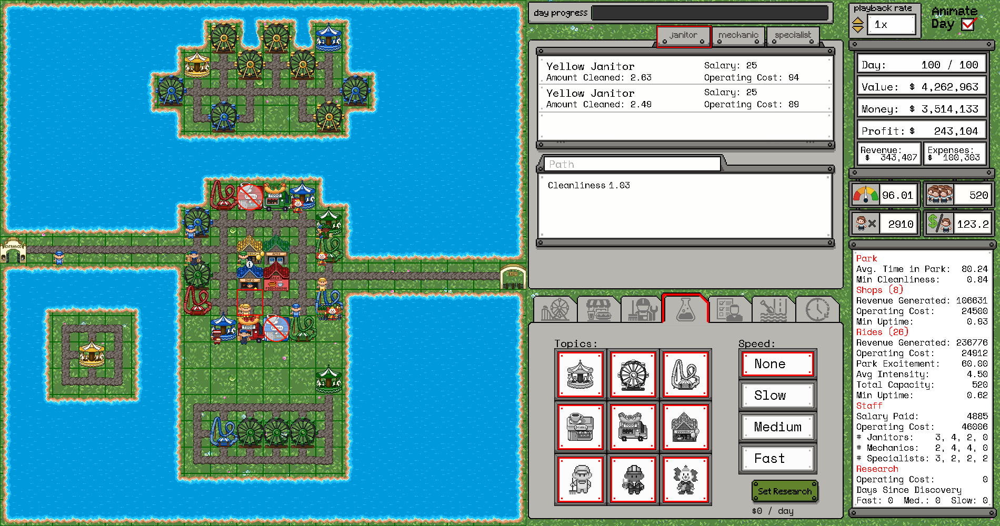

<p align="left">
  
  <br>
</p>


 


# Mini Amusement Parks
<p align="left">
  <a href="https://maps.skyfall.ai/">
    
  </a>
  <a href="https://openreview.net/forum?id=nJF0A933EO">
    
  </a>
  <a href="https://opensource.org/licenses/MIT">
    
  </a>
  <a href="https://www.python.org/downloads/">
    
  </a>
  <a href="https://nodejs.org/en">
    
  </a>
</p>

Mini Amusement Parks (MAPs) is a challenging amusement park business simulator designed for AI research. MAPs tests a player's ability to plan across long horizons, actively learn the dynamics of the enviornment, be adaptable to stochastic outcomes, and reason about spatial relationships. The best performing frontier models score approximately **10\% of human performance** on medium difficulty. Built to bridge the gap between simulation and reality, MAP is designed to chart progress of systems toward robust business decision-making. 

MAPs also contains several features useful to research including both GUI and text-only interfaces, adjustable difficulty, a sandbox mode with corresponding evaluation protocols, and a [live leaderboard](https://maps.skyfall.ai/leaderboard) of human and AI evaluations that includes the ability to [play online](https://maps.skyfall.ai/play). 


For additional details and experimental results, see [our paper](https://openreview.net/forum?id=nJF0A933EO).



## Table of Contents
- [Getting started](#getting-started)
  - [Installation](#installation)
  - [Running the game](#running-the-game)
  - [Docker Deployment](#docker-deployment)
- [Game Documentation](#game-documentation)
- [License](#license)

## Getting started

### Installation 
This codebase has only tested on MacOS/Linux. All instructions should be run from the directory that houses this README.md

#### Install backend server

Install javascript, then run:  
```bash
    npm install 
```
#### Install Python Interface and Frontend

Choose an option depending on your environment manager  
(Option #1.) Create conda environment:  
```bash
    conda create --name maps python=3.12
    conda activate maps
    pip install -e .
```

(Option #2.) Create venv environment:  
```bash
    python3.12 -m venv .venv 
    source .venv/bin/activate
    pip install -e .
```

(Option #3.) Create a uv environment:  
```bash
  uv venv --python 3.12
  source .venv/bin/activate
  uv pip install -e .
```

##### Running the game in Python
To play the game using a human interface on training layouts:
```bash
    python launch_game.py [--scale SCALE] [--port PORT]
```
Default scale is 0.75. Default port is 3000

For programmatic access, the `MiniAmusementPark` class can be imported, it implements the standard [Gymnasium](https://gymnasium.farama.org/) broadly used in RL research.

```python
from map_py.mini_amusement_park import MiniAmusementPark

with MiniAmusementPark(host="localhost", port='3000', render_park=False) as game:
    game.reset()
    curr_state, reward, term, trunc, info = game.step('wait()')
```


#### Install JS Interface and Frontend
```bash
    cd website/;
    npm install;
    ./setup-dev.sh;
    cd ..;
```
Note: ./setup-dev.sh creates the symlinks to share static assets between `./shared/` and `./website/static/`. It
- Removes duplicate files from `website/static/`
- Creates symlinks from `website/static/` to `../shared/`
- Ensures any changes to `./shared/` are immediately reflected in local development


**Important:** The `./shared/` directory is the source of truth for all static assets (images, configs, layouts, etc.). During local development, symlinks are used. During Docker builds, files are copied from `./shared/` into the container.

##### Running the game in a browser
Ensure localhost port 3000 is not being used.
```bash
    lsof -i :3000
```
Should return nothing. If it does, kill the job listed or use a different port.

Run a headless park:
```bash
  node map_backend/server.js --vis &
```
Note: This deploys the backend server as a background process. You can call `fg` to bring it back to the foreground to close it.

Deploy the frontend:
```bash
    cd website/;
    npm run dev
```
If the webpage is not automatically opened for you, go to the url: http://localhost:3001

You can change the port number by setting the environment variable `MAP_PORT`.

### Docker Deployment

The MAP application can be easily deployed using Docker, which bundles both the website frontend and backend server into containerized services.

#### Prerequisites
- Docker (version 20.10 or higher)
- Docker Compose (version 2.0 or higher)

#### Quick Start with Docker

To run the entire application stack with Docker Compose:

```bash
docker-compose up --build
```

This will:
- Build both the website and backend Docker images
- Start the backend server on `http://localhost:3000`
- Start the website frontend on `http://localhost:3001`
- Configure networking between the services

Access the game at: **http://localhost:3001**

To run in detached mode (background):
```bash
docker-compose up -d --build
```

To stop the services:
```bash
docker-compose down
```

#### Building Individual Services

**Build and run the backend only:**
```bash
docker build -f map_backend/Dockerfile -t map_backend .
docker run -p 3000:3000 map_backend
```

**Build and run the website only:**
```bash
docker build -f website/Dockerfile -t map-website .
docker run -p 3001:3001 map-website
```

#### Architecture

The Docker setup consists of:
- **Backend Service**: Express.js server with Socket.io for real-time game state management
  - Port: 3000
  - Dockerfile: `map_backend/Dockerfile`
- **Website Service**: SvelteKit frontend with Phaser game engine
  - Port: 3001
  - Dockerfile: `website/Dockerfile`
- **Shared Network**: Bridge network for inter-service communication
- **Static Assets**: All assets are sourced from `./shared/` directory

#### Environment Variables

You can customize the deployment by setting environment variables in `docker-compose.yml` or via a `.env` file:

- `MAP_PORT`: Backend server port (default: 3000)
- `PORT`: Website port (default: 3001)
- `NODE_ENV`: Node environment (default: production)

## Observation Space

To provide compatibility for a wide-range of methods, we provide three different observation formats, each containing the same underlying data: 
1. The GUI used by humans (see launch_game above) 
2. A text-based representation using JSON compatible objects (via Pydantic) that can be ingested by modern LLMs. You can find an example of what this looks like in example_text_obs.txt
3. A gym-compatible grid-vector based observation that can be fed to more traditional neural networks.

## Game Documentation
Please refere to the [documentation](documentation.md)

# License

Copyright © 2025 Skyfall AI

Permission is hereby granted, free of charge, to any person obtaining a copy of this software and associated documentation files (the “Software”), to deal in the Software without restriction, including without limitation the rights to use, copy, modify, merge, publish, distribute, sublicense, and/or sell copies of the Software, and to permit persons to whom the Software is furnished to do so, subject to the following conditions:

The above copyright notice and this permission notice shall be included in all copies or substantial portions of the Software.

THE SOFTWARE IS PROVIDED “AS IS”, WITHOUT WARRANTY OF ANY KIND, EXPRESS OR IMPLIED, INCLUDING BUT NOT LIMITED TO THE WARRANTIES OF MERCHANTABILITY, FITNESS FOR A PARTICULAR PURPOSE AND NONINFRINGEMENT. IN NO EVENT SHALL THE AUTHORS OR COPYRIGHT HOLDERS BE LIABLE FOR ANY CLAIM, DAMAGES OR OTHER LIABILITY, WHETHER IN AN ACTION OF CONTRACT, TORT OR OTHERWISE, ARISING FROM, OUT OF OR IN CONNECTION WITH THE SOFTWARE OR THE USE OR OTHER DEALINGS IN THE SOFTWARE.